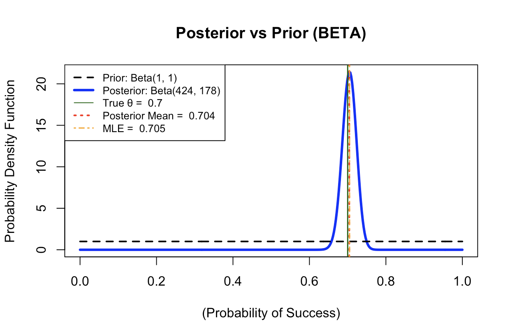

# Bayesian Inference in R: Beta-Binomial Conjugate Model

This repository contains an R script (`Bayes_Beta.R`) that demonstrates a fundamental concept in Bayesian statistics: **Conjugate Priors**. Specifically, it models the estimation of a binomial probability ($\theta$) using the **Beta-Binomial model**.

The Beta distribution acts as the conjugate prior for the Binomial likelihood function, which means the resulting **Posterior Distribution** is also a Beta distribution, making the calculation analytically straightforward.

## 1. Model Implementation

The script simulates a fixed number of periods ($T=600$) with a known true probability of success ($\theta=0.7$) and then uses the observed data to update the belief about $\theta$.

### Key Components:

* **Prior Distribution:** Assumes a neutral (or non-informative) Beta distribution, $\text{Beta}(a_0=1, b_0=1)$, which is equivalent to a Uniform distribution.
* **Likelihood:** Derived from the simulated Bernoulli trials ($\text{Binomial}$ likelihood).
* **Posterior Distribution:** The updated Beta distribution, $\text{Beta}(a_T, b_T)$, where the new parameters are updated using the simple rules of the conjugate prior:
    * $a_T = a_0 + (\text{Number of Successes})$
    * $b_T = b_0 + (\text{Number of Failures})$

## 2. Validation and Output

The script calculates and plots several key elements:

* **Prior Density:** The initial $\text{Beta}(1, 1)$ belief.
* **Posterior Density:** The updated, concentrated belief about $\theta$.
* **True $\theta$:** A vertical line indicating the actual probability of success (0.7).
* **Bayes Estimator (Posterior Mean):** The mean of the posterior distribution.
* **Maximum Likelihood Estimator (MLE):** The classical frequentist estimate ($\frac{\text{Successes}}{T}$).

### Visual Validation

The plot clearly shows how the **Prior** distribution is relatively flat, and the observed data pulls the **Posterior** distribution towards the **True $\theta$** and the **MLE**.



## 3. How to Run the Script

You need to have **R** installed on your system to run the analysis.

1.  **Save the file:** Ensure the code is saved as an R file (e.g., `Bayes_Beta.R`).
2.  **Save the Image:** Make sure your plot screenshot is saved in the same directory as the `README.md` file, named **`bayes.png`**.
3.  **Run the R script from your terminal:**

    ```bash
    Rscript Bayes_Beta.R
    ```

### Dependencies

This script uses only base R functions and requires no external packages